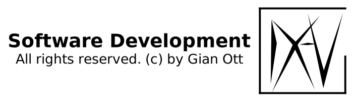

# Template repository

 

## Description

## Current version

*or*
[GitHub pages](https://nichtgian.github.io/template/)

## Team

<table>
  <tbody>
    <tr>
      <td align="center" valign="top">
        
         
        <a href="https://github.com/Nichtgian">Nichtgian</a>
      </td>
     </tr>
  </tbody>
</table>

***

